<p align="center">
  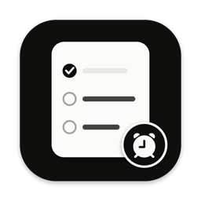
</p>

<h1 align="center">Docket</h1>

<p align="center">
  <b>Tasks, notes, messages and a second brain, for people whose day is already full.</b><br>
  A native Mac app and an iPhone app. Real dates on every line, alarms you can't sleep through,<br>
  Slack and Gmail in one place, and a memory that answers with its sources.<br>
  Local-first, no account, no server. AI is optional and runs on your own Google Gemini key.
</p>

<p align="center">
  
  
  
  
  
  
</p>

<p align="center">
  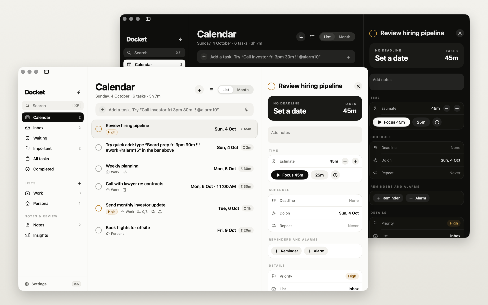
</p>

---

## Why Docket

Most to-do apps are built for planning. Docket is built for the day you're actually having, and for
remembering what happened in it.

- **Every line tells you when.** No "Today" and "Tomorrow" headings to decode. Each task shows its real
  date ("Fri 16 Oct · 15:00"), its time and how long it takes. "Today" and "Tomorrow" are buttons, never labels.
- **Typing, or talking, is the interface.** `Board prep fri 3pm 90m !!! #work @alarm15` sets all of it in
  one line. Or say "Call Rohan next Friday at 3 for half an hour, remind me 15 minutes before".
- **Walk out of a meeting, talk for a minute, get the tasks.** A voice debrief on the iPhone or the Mac
  turns into tasks with real dates and a memory of the meeting.
- **A memory that cites its sources.** Everything you save, write, finish or reply to can be remembered,
  sorted into topics, and asked about. Answers come only from your own memories, with numbered sources.
- **Calm by design.** Ink on warm paper, one obvious action per screen, dark mode throughout.
- **Yours.** Data lives on your Mac (and your own iCloud Drive if you add the iPhone). No account, no
  server, no tracking. AI is opt-in and uses your own key.

Built for anyone with a full calendar: founders, marketers, sales, engineers, managers and artists. Pick a
**lens** and Docket uses your words: a salesperson's memory has *Deals*, *Contacts*, *Next steps* and
*Objections*; an artist's has *Works*, *Collaborators*, *Sketches* and *Inspiration*.

## Features

Everything below is in the app today. Items marked *(AI)* need a Gemini key; everything else works without one.

### Tasks and calendar

- **One calendar list.** Overdue first, then every dated task in order, each with its date, time and length
  on the right. **Month** view to drag a task to another day; **⌥⌘C** for compact rows.
- **Quick add that reads your line.** Dates ("next tue 10:30", "eod", "in 2 hours"), lengths, priorities,
  lists and tags, repeats and reminders, shown as it's understood. Prefer clicking? The **Date**, **Time**
  and **List** menus under the field do the same.
- **Deadline and "Do on" are separate.** Plan a task for Tuesday without moving its Friday deadline.
- **Repeats:** daily, every weekday, chosen weekdays, every N weeks, monthly, yearly.
- **Reminders and alarms.** Reminders are normal notifications. Alarms ring in a window that floats above
  everything, full-screen apps included, until you snooze or dismiss them.
- **Views:** Calendar, Inbox, Important, All Tasks, Completed, Waiting, your own lists and tags, and Insights
  (what you finished this week and where your focus went).
- **Bulk editing.** ⌘-click, ⇧-click or ⌘A, then **T** / **M** / **W** / **X** (today, tomorrow, next week,
  done), or change list, priority, tags, estimate or *Waiting on* for all of them. One ⌘Z undoes the lot.
- **Delegation and slipping work.** Put a name in **Waiting on** and the task moves to Waiting with that
  person on the row. A task pushed back again and again gets a nudge: *do it, delegate it, or drop it*.
  "3 overdue · Move all to today" when things pile up.
- **Focus sessions** on a task: counts down its estimate (or a Pomodoro), or runs as a stopwatch.
- **Calendar events** next to your tasks (optional, Settings → Planner), a **morning briefing**
  notification, and a workday that defines "eod".
- **Plan with AI (⌘J)** *(AI)*: write a brain dump, review the proposed tasks (dates, lengths, priorities,
  lists, steps), add the ones you want. **Break down with AI** splits a task into steps; **Order my day**
  suggests an order for today; **Find tasks** pulls action items out of a note.
- **Search (⌘F)** across every task and note: titles, notes, steps, lists, tags and people, with
  `"phrases"` and `#tags`.

<p align="center">
  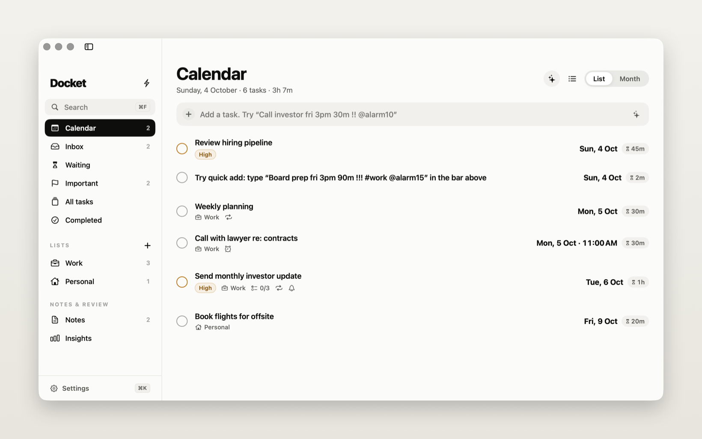
  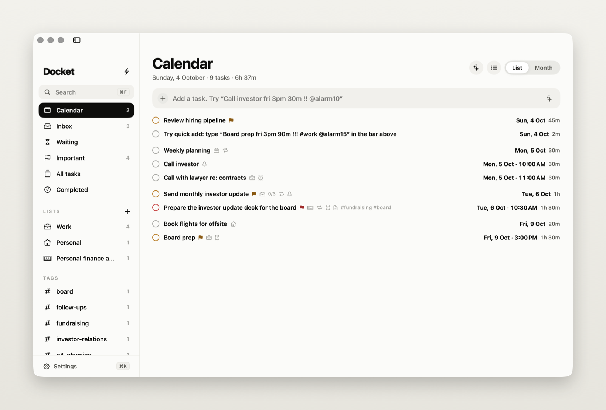
</p>
<p align="center">
  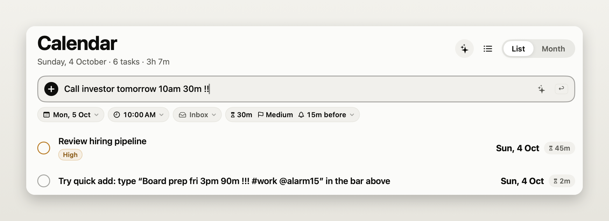
</p>
<p align="center">
  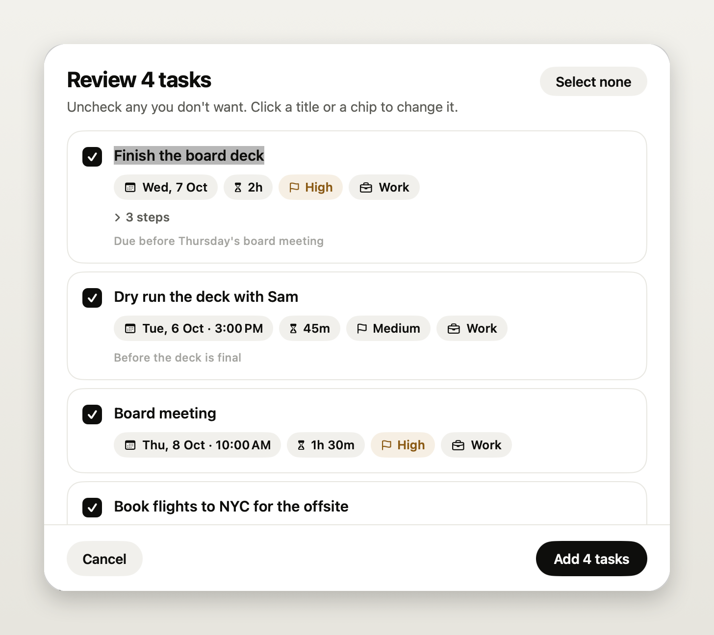
</p>
<p align="center">
  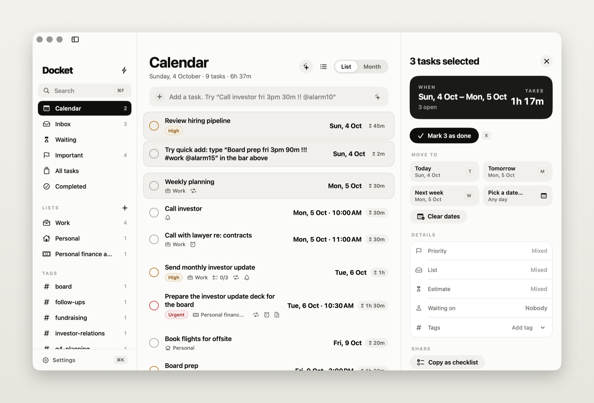
  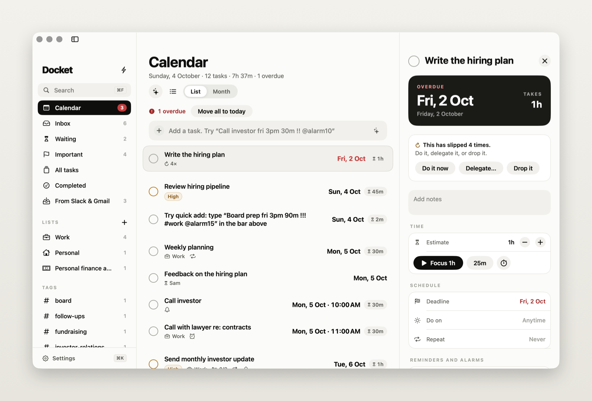
</p>

### Notes

- Notes open formatted: headings, lists, clickable checkboxes, quotes, tables, code, photos and videos.
  **⌘E** switches to the Markdown, which is styled live as you type.
- Paste Markdown from ChatGPT, Claude or a README into an empty note and it renders right away.
- Checklist items become tasks that stay in sync with the note.
- **Templates:** Meeting Notes, 1:1, Daily Note, Decision Record, Idea (hold the new-note button).
  **⌘D** opens today's daily note; **⌥⌘V** makes a note from the clipboard.
- Export notes as Markdown (one `.md` per note).

<p align="center">
  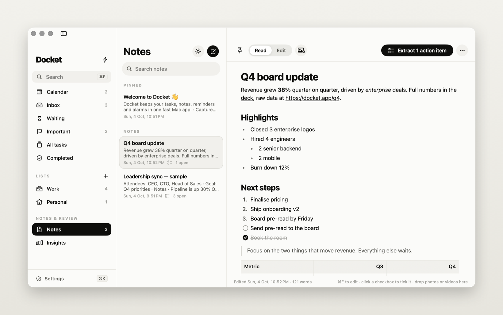
</p>

### Messages: Slack and Gmail

Connect Slack and Gmail in **Settings → Connections** and the messages that need you land in
**Messages** (⌘9), in **All**, **Slack** and **Email** tabs, with a Starred filter.

- **What comes in:** Slack messages you react to with your save reaction (📌 by default; 🔖 📝 📥 ⭐️ 👀 also
  available) from the last 30 days, @mentions and direct or group messages from the last 3 days, starred
  emails (last 30 days), and unread important emails that need a reply (last 2 days). With AI on, Gemini
  keeps only the ones that need you and writes a suggested task for each.
- **Read everything.** The whole Slack thread or email conversation, formatted text, images and files
  (Quick Look or save). Emails render in a locked-down view: no scripts, no remote images, no tracking pixels.
- **Summaries** *(AI)*: important threads open with 2–4 bullets and "Needs from you: …"; any other has a
  Summarize button.
- **Star it** (**S**). Stars sync with Gmail and with Slack's *Save for later*.
- **Add notes** to a message; they come along when it becomes a task.
- **Reply** yourself, or **Draft with AI** (Brief, Friendly or Formal) from the thread and your notes. Send it
  in the Slack thread or the email conversation, or save a Gmail draft. Docket always asks before sending.
- **Turn it into a task** in one click, **Save as note**, or **Remember** it in Memory.
- Checks every 2 minutes (or every 15), with a notification for each new message (held during focus).
- Focus sessions can set your Slack status to "Heads down" and pause notifications; you can share your
  plan to a channel.

<p align="center">
  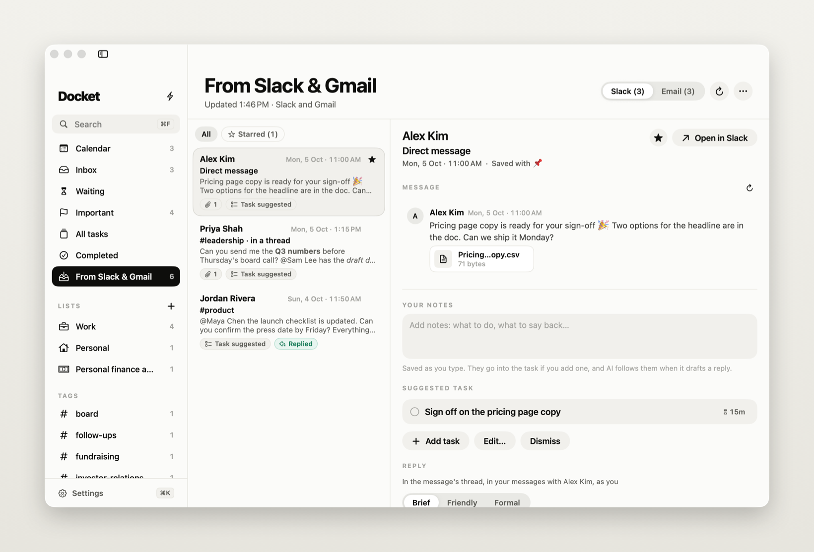
  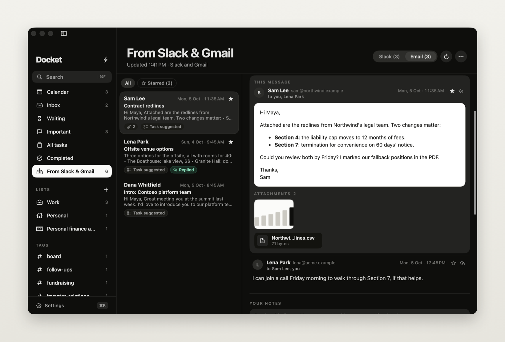
</p>

### Memory: your second brain (⇧⌘M)

- **Remember anything.** Drop files, photos, links or text on Memory; use **+** (New Note, Add Link, Add
  Files, Record Voice Note); switch Quick Capture to **Memory**; click **Remember** on a message; or
  capture from the iPhone.
- **Remember automatically** (Settings → Memory, each behind its own switch): notes once you stop
  editing, and message threads (summaries, replies you send, messages you turn into tasks or notes). The
  first time, it also takes in your existing notes. Tasks never go into memory: memory is what you know,
  tasks are what you do.
- **Every memory is read for you** *(AI)*: a title, a 1–2 sentence summary, key takeaways, people,
  projects, topics, and *moments*: decisions, promises (who owes what, by when), ideas and insights. Links
  are fetched and read; images, PDFs and recordings are described or transcribed.
- **Library** with filters (All, Notes, Links, Media, Files, Messages) and **Browse** by people,
  projects, decisions, promises, ideas and insights, all in your lens's words. **Worth revisiting** and
  **On this day** bring back older memories.
- **Ask with sources.** Type a question in the one field at the top (or press ⌘K and pick
  "Ask memory: …"). *(AI)* Gemini answers only from your memories, with **[n]** citation chips that open
  the source, a Sources list with real dates, and follow-up questions. If your memory doesn't contain the
  answer, it says so. Without a key, the field searches by text.
- **Memory works for your tasks.** A task's **Brief** shows related memories, the people, organisations
  and projects it names (each opens its page) with their open promises, and **Brief me** *(AI)*: a short
  answer from your memory with citations. Planning, Break down, Find tasks in a note, message triage, voice
  notes and dictation *(AI)* all get what memory knows (names, dates, who you're waiting on) to fill in the
  tasks they write. In Memory, a promise has **Add as task** (yours: due on its date; someone else's: a
  follow-up waiting on them), and any memory has **Turn into tasks** *(AI)*; such tasks link back with
  "From memory: …". A message thread shows the few memories related to it.
- **Profile: "What Docket knows about me."** Facts Docket worked out from your memory *(AI)*, plus your own.
  Edit, pin (pinned facts stay exactly as written) or forget any of them; **Refresh from my memory**. Docket
  reads them before it summarises or answers.
- **Lenses:** Founder, Marketer, Sales, Engineer, Manager, Artist (pick any). They change the words Docket
  uses, what it looks for in each memory, and the example questions under Ask.
- **Each memory's page:** editable title, summary, takeaways, moments, topics (**Move to topic…**), people
  and projects (each opens its page), where it came from, its files, related memories, and for a voice note
  the player, the tasks it made and the transcript.

### Brain: topics, pages and a map of what you know

Memory has three views: **Library · Topics · Map**. The brain organises itself in the background and keeps
what you fix by hand.

- **One name per thing.** "Rohan", "Rohan ji" and "R. Mehta" become *Rohan Mehta*; "Acme Pvt Ltd" and "Acme
  Inc" are one company. Merge two pages, or split off a name that isn't the same person; it remembers both,
  and never merges a split name back.
- **Topics in areas.** Memories are clustered into topics, grouped under a handful of areas (Fundraising,
  Sales, Product, Hiring…), with sub-topics. A new memory joins its closest topic or waits in **Unsorted**.
  Docket reorganises after 25 new memories or 7 days, or when you click **Organise now**, and tells you what
  changed ("2 new topics: Annual discounts, Store pilots").
- **Living pages** for every topic, person, organisation and project *(AI)*: **What you know** with [n]
  citations, key facts, open questions, open promises and decisions, sub-topics, related things and a
  timeline. Write the summary yourself and Docket keeps your words; **Let Docket write it** hands it back.
- **Notes that disagree.** Pages flag conflicting facts with their sources and dates ("Pricing: $40/seat on
  Sat 12 Sep vs $45 on Sat 3 Oct"); mark them settled when they are.
- **Connections you haven't made:** pairs of memories from different topics that look related but share no
  people or projects, with a one-line reason. Dismiss the ones that aren't useful.
- **Weekly digest:** "What you learned 5–11 Oct": new and busiest topics, decisions, open promises and a
  connection.
- **Corrections** from any page's ⋯ menu: rename, merge into…, split off, move to another area or topic,
  lock (Docket won't rename, move or refile it), and delete a topic or area.
- **Mental map:** areas, topics, people, organisations and projects as dots coloured by area and sized by
  how much is behind them. Drag, pinch or ⌘-scroll to zoom; hover to see neighbours; click to open a page;
  double-click to see only its neighbourhood. Chips hide kinds. The **time slider** steps back through the
  days things first appeared, so you can watch what you know grow.

Without a key the brain still works: names are matched as text, topics come from shared words, and pages
show the timeline, related things and moments without a written summary.

### Voice

- **Voice debriefs: talk, get tasks.** **⇧⌘R** on the Mac (or the mic in Quick Capture's Note and Memory
  modes, the menu bar, or Memory's **+**) records a voice note with a live transcript. Stop, and Docket
  shows "Added 3 tasks", each with its real date ("Send revised quote to Rohan Mehta · Fri 16 Oct") and ✕,
  plus **Undo all**. The recording becomes a memory with the transcript, a summary, people, decisions and the
  promises others made. Hindi, English or both. Up to 30 minutes on the Mac, 60 on the iPhone. Without a
  key, the recording is kept and you get one task to go through it.
- **Dictate and schedule tasks.** **⇧⌘D**, or the mic in any add field (the main window, Quick Capture's Task
  mode, the menu bar). Say "every weekday at 9:30 standup, alarm". Your words appear as you speak; a click,
  Return, ⇧⌘D or a 2-second pause stops it. *(AI)* The tasks are added at once with their date, time,
  length, reminder or alarm, repeat and list; ✕ removes one, **Undo all** or ⌘Z takes them back, a click opens
  one. Esc cancels. Without a key, the words stay in the field and quick add reads them.
- **Ask by voice.** The mic in Memory's Ask field dictates the question and asks it when you stop.
- **Read aloud.** **Read aloud** on an answer speaks it with the system voice.
- Live transcription uses Apple's speech recognition, on the device when the language supports it.

### iPhone app

Capture, record debriefs, dictate tasks, browse and ask your memory, and tick off tasks on the go. It
syncs with the Mac through a **Docket** folder in your own iCloud Drive: no server, no account.

- **Capture:** one big mic for a debrief, a note field you can type or dictate into, Photo (take or pick),
  File, Paste link, and Task (tap for the composer, long-press to say it).
- **Memory:** Library with search (by text, and by meaning with a key), Topics with pages, and the Map.
- **Ask** by typing or by voice, with sources and **Listen** to hear the answer.
- **Today:** overdue, today, the next 7 days and later; tick, untick or swipe to delete.
- **Siri, Action Button, Shortcuts:** "Record in Docket", "Schedule a task in Docket", and `docket://record`.

Full feature list, setup and build steps: **[iOS/README.md](iOS/README.md)**.

### Menu bar, Quick Capture and shortcuts

- **Quick Capture** from any app with a global shortcut (⌃⌥T, configurable): Task, Note or Memory
  (⇥ switches), with dictation, voice notes and file drop.
- **Menu bar dropdown:** today's agenda, quick add (with the mic), the running focus timer, and the newest
  Slack messages and emails. Optional count next to the icon or on the Dock icon, and a menu-bar-only mode.
- **⌘K** jumps to any task, note, list or view, or asks your memory.
- Full keyboard control: see [Keyboard shortcuts](#keyboard-shortcuts).

<p align="center">
  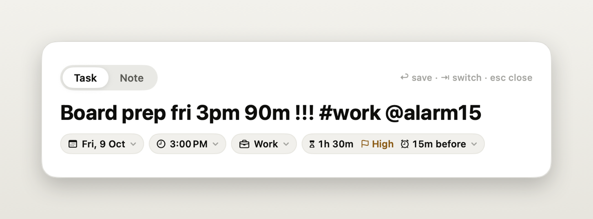
  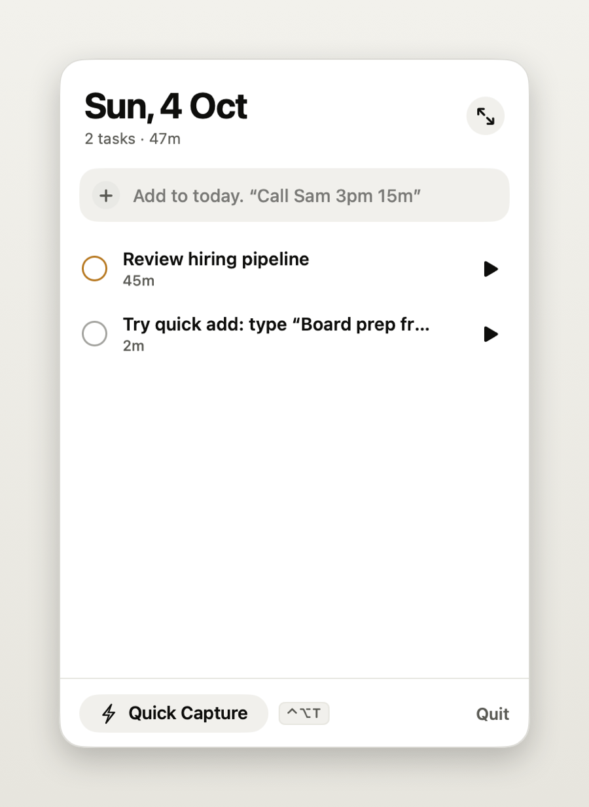
</p>
<p align="center">
  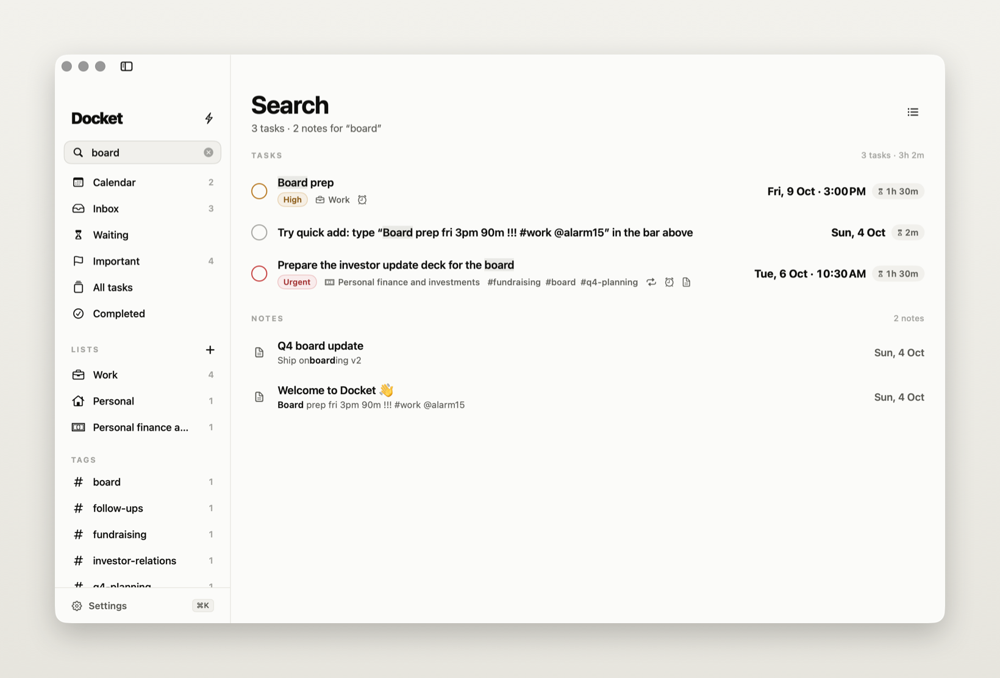
</p>

### Privacy and data

- Tasks and notes in one JSON file on your Mac, with daily backups for 30 days. Memory in its own folder
  next to it. No account, no server, no analytics.
- AI is off until you add a key, and **Use AI** (Settings → AI) turns every AI feature off at once. With it
  on, only what a feature needs goes to Google Gemini (details in [Set up AI](#set-up-ai-optional)).
- Keys and tokens live in a file only your user account can read (Mac) or in the iPhone's Keychain, and are
  never written to the data file or to logs.
- iPhone sync is off until you turn it on, and goes only through your own iCloud Drive.
- The microphone is on only while you record or dictate.
- Full details: [PRIVACY.md](PRIVACY.md).

## Install

1. Download the latest `Docket-x.y.z.dmg` from [Releases](../../releases/latest) and drag **Docket** into
   **Applications**.
2. Releases aren't notarized yet, so macOS asks you to confirm the first launch:
   - **macOS 15 or later:** try to open Docket, click **Done**, then **System Settings → Privacy & Security →
     Open Anyway**.
   - **macOS 13–14:** right-click Docket in Applications → **Open** → **Open**.
3. Allow notifications so reminders and the morning briefing can appear. Turn on **Open Docket when I log
   in** (Settings → General) so alarms ring after a restart.
4. Allow the microphone and speech recognition the first time you record or dictate.

The first launch includes a **Welcome to Docket** note with a cheat sheet, and a few sample tasks you can
delete. **Help → Docket Guide & Quick-Add Cheat Sheet** brings the guide back.

The iPhone app isn't on the App Store; you build it onto your phone with Xcode. See
[iOS/README.md](iOS/README.md).

## Set up AI (optional)

1. Get a free API key from [Google AI Studio](https://aistudio.google.com/apikey).
2. Paste it into **Settings → AI → Gemini API key** and click **Save**. Docket checks it (**Test
   connection**). It's saved on your Mac in a file only your user account can read, and never shown again.
3. Press **⌘J** and write something like *"board meeting thursday 10am, deck by wednesday, dry run with Sam
   before that"*.
4. Open **Memory** (⇧⌘M), pick your lenses, and start saving or asking.

The default model is `gemini-3.5-flash`; change it under **Model** in the same place. Memory search uses
`gemini-embedding-2`; after changing models, **Settings → Memory → Rebuild search index**.

**What goes to Gemini, and only with a key and Use AI on:**

- Tasks and notes: the text you send to an AI feature, plus your list and tag names.
- Messages: new messages Docket finds (a Slack message with its channel and sender; an email's sender,
  subject and preview), so it can pick the ones that need you. **Draft with AI** and summaries send the
  thread and your notes for it.
- Memory: each memory's content to be summarised and indexed (link pages Docket fetched, images, PDFs and
  recordings included), your question and the few memories that match it when you ask, and your profile
  facts as context. Living pages send the memories behind that page.
- Voice: the recording of a voice debrief, or the words of a dictated task, with your list names and the
  names in your memory.

## Connect Slack (optional)

Docket talks to Slack through a small Slack app of your own, so messages go straight from Slack to your Mac.

1. **Settings → Connections → Create app.** Slack opens with everything filled in. Pick your workspace and
   click **Create**.
2. On the app's page, click **Install to Workspace** and allow it.
3. Copy the **User OAuth Token** (it starts with `xoxp-`), paste it into Docket and click **Connect**.
4. Choose the **Save with a reaction** emoji, and whether to include **Mentions** and **Direct messages**.

It asks for these user scopes: `reactions:read` and `search:read` (finding messages), `users:read` (who sent
what), `files:read` (attachments), `channels:history`, `groups:history`, `im:history` and `mpim:history`
(whole threads and DMs), `stars:read` and `stars:write` (starring), `chat:write` (replies and sharing your
plan), `users.profile:write` and `dnd:write` (focus status), and `channels:read`, `groups:read`, `im:read`,
`mpim:read` (the channel picker and DMs). Each person in a workspace connects their own app, and nothing is
shared between them.

Connected with an older version? Docket shows **Update the app** in Messages: create the app again (one
click), install it, paste the new token, and delete the old app.

## Connect Gmail (optional)

Gmail uses Google sign-in in your browser, which needs an OAuth client ID from Google Cloud. It's a
one-time, five-minute setup; **Settings → Connections** links to each step:

1. Create a Google Cloud project.
2. Turn on the **Gmail API**.
3. Set up the **OAuth consent screen** (Google Auth Platform → **Audience**). On Google Workspace choose
   **Internal**. Otherwise choose **External** and add every address that will sign in under **Test
   users**; without that, Google shows *"Access blocked: … has not completed the Google verification
   process"*. External apps in testing mode need reconnecting about once a week; **Publish app** on the same
   page stops that (Google then shows an "unverified app" warning you can click through).
4. Create an **OAuth client ID** of type **Desktop app**, and paste its ID and secret into Docket.
5. Click **Connect Gmail** and sign in.

Docket asks for `gmail.modify`: it reads your mail, stars what you star, and sends or saves a draft only
when you click **Send reply** or **Save as Gmail draft**. It never deletes or archives anything.

## Sync with your iPhone (optional)

There's no server: the Mac and the phone share a **Docket** folder in your iCloud Drive.

1. **On the Mac:** Settings → Memory → iPhone → turn on **Sync with iPhone**. That creates
   `iCloud Drive/Docket` (or use **Change…** to pick another folder) and starts publishing.
2. **On the iPhone:** install Docket ([iOS/README.md](iOS/README.md)), tap the gear → **Choose folder** →
   iCloud Drive → **Docket**.

The phone drops captures, tasks and recordings into `Docket/Inbox/`; the Mac takes them in (about every
minute, and whenever the folder changes) and publishes your memory, topics, the map and your upcoming tasks
to `Docket/Library/` for the phone to read. **Last synced** in the same settings shows when it last worked.

## Import from ENGRAM

Coming from ENGRAM? In ENGRAM, **Settings → Export** saves a `.json` file. In Docket, **Settings → Memory →
Import from ENGRAM** reads it: each entry becomes a memory with its date, title, summary, takeaways,
original text and source link, and people, organisations and topics are matched to it. Importing again
skips what's already there ("Imported 412 memories (3 already here)").

## Keyboard shortcuts

| Shortcut | Action |
| --- | --- |
| ⌃⌥T (anywhere) | Quick Capture (configurable) |
| ⌘N / ⇧⌘N | New task / new note |
| ⇧⌘D | Dictate a task (again, or Return, to stop and schedule; Esc cancels) |
| ⇧⌘R | Record a voice note |
| ⇧⌘M | Memory |
| ⌘K | Jump to anything, or ask your memory |
| ⌘F | Search tasks and notes (find in a note while editing it) |
| ⌘J | Plan with AI |
| ⌘1 – ⌘9 | Calendar, Inbox, Notes, Important, All Tasks, Completed, Insights, Waiting, Messages |
| ⌘0 | Bring back the main window |
| ↑ / ↓, ⇧↑ / ⇧↓ | Move through tasks, extend the selection |
| ⌘-click, ⇧-click, ⌘A | Select several tasks |
| T / M / W / X | Selected tasks: today / tomorrow / next week / done |
| ⌘T / ⌥⌘T | Do today / move to tomorrow |
| ⌥⌘↑ / ⌥⌘↓ | Move a task up or down within its day |
| Return / Esc | Open or close the task panel |
| Delete | Delete the selected tasks (⌘Z brings them back) |
| ⌘↩ | Complete the selected task |
| ⇧⌘F | Start a focus session on the selected task |
| ⌃⌘1 – ⌃⌘4 | Priority: urgent, high, medium, low |
| ⌥⌘C | Compact rows |
| S | Star the selected message (Messages) |
| ⌃⌘S | Hide or show the sidebar |
| ⌘D | Today's daily note |
| ⌘E | Read or edit a note |
| ⌥⌘V | New note from the clipboard |

## Quick-add syntax

| Type | Examples |
| --- | --- |
| When | `today`, `tomorrow 4pm`, `fri`, `next tue 10:30`, `dec 3`, `in 2 hours`, `eod`, `eow`, `next week` |
| How long | `15m`, `45 min`, `1h30m`, `1.5h` |
| Priority | `!` low · `!!` medium · `!!!` high · `!!!!` urgent |
| List or tag | `#work` (a list with that name, otherwise a tag) |
| Repeat | `daily`, `every weekday`, `every mon & thu`, `every 2 weeks`, `monthly` |
| Reminders | `@remind`, `@remind30` (30 min before), `@alarm10` (a loud alarm 10 min before) |

## Your data

- Tasks and notes live in `~/Library/Application Support/Docket/docket.json`, with photos and videos from
  notes in `attachments/` next to it.
- Docket keeps a daily backup of tasks and notes for 30 days in `Backups/`. If the data file is ever
  unreadable or missing, it restores the newest backup on its own.
- **Settings → Data** backs up everything (attachments included) and restores or merges it on another Mac,
  or exports notes as Markdown.
- Memory lives in `Memory/` in the same folder: `memory.json`, the search index (`vectors.bin`), the brain
  (`brain.json`), voice-note bookkeeping (`voice.json`) and saved files in `Files/`. **Settings → Memory →
  Storage → Show in Finder** opens it. It isn't part of the daily backups or **Back up everything**, so copy
  that folder if you want a copy of your memory.
- API keys and tokens live in `secrets.json` in the same folder, readable only by your user account
  (permissions 600), never in the data file. Docket doesn't use the macOS keychain, so it never interrupts
  you for your password after an update.
- With iPhone sync on, the shared folder holds what the phone sent (until the Mac takes it in) and what the
  Mac published for the phone.

## Build from source

### Mac

Requirements: macOS 13+, Xcode 15 or later (Swift 5.10). No third-party dependencies.

```bash
git clone https://github.com/utkarshiam/Super-focused-mac-mode.git docket && cd docket
swift build && .build/debug/Docket     # quick debug run
swift test                             # the unit tests (Docket and MemoryKit)
scripts/build.sh                       # tests + universal Docket.app + DMG + ZIP in dist/
```

Recording and dictation need the microphone, which macOS only grants to an app bundle: use the
`Docket.app` from `scripts/build.sh` for voice features (the bare debug binary says so instead of recording).

`scripts/build.sh` takes `VERSION=1.2.0`, `BUILD_NUMBER=…` and `BUNDLE_ID=com.yourco.docket`.

**Signing and notarization.** Builds are ad-hoc signed by default, which is fine for your own Macs. To ship
without the "Open Anyway" step, sign with your own Developer ID and notarize:

```bash
xcrun notarytool store-credentials docket-notary --apple-id you@company.com --team-id TEAMID   # once
SIGN_IDENTITY="Developer ID Application: Your Company (TEAMID)" NOTARY_PROFILE="docket-notary" scripts/build.sh
```

**Private builds with a built-in key.** To hand a build to someone without them pasting a key, put
`GEMINI_API_KEY` (and optionally `GEMINI_MODEL`, `GOOGLE_CLIENT_ID`, `GOOGLE_CLIENT_SECRET`) in a `.env`
file at the project root and run `EMBED_SECRETS=1 scripts/build.sh`. The keys end up inside the app, so
never publish a DMG built that way. `.env` is git-ignored.

### iPhone

Open `iOS/DocketPhone.xcodeproj` in Xcode 26 and run the `DocketPhone` scheme. It uses the shared
`MemoryKit` package from this repo. To run it on your own phone, sign it with your own Apple ID or team.
Step by step, including demo mode for screenshots: [iOS/README.md](iOS/README.md).

### Shipping a release

`scripts/release.sh` ships builds with an App Store Connect API key. It reads `APPLE_TEAM_ID`, `ASC_KEY_ID`
and `ASC_ISSUER_ID` from the environment or the git-ignored `.env`, plus the key's `.p8`, which goes in
`~/.appstoreconnect/private_keys/` and never in the repo.

- `scripts/release.sh ios`: archives the iPhone app, signs it for your team and uploads it to TestFlight.
- `scripts/release.sh mac`: builds the Mac app with your team's Developer ID certificate, then notarises and
  staples the DMG, so it opens without the "Open Anyway" step.

## How it's built

```
Package.swift      the Mac app (Docket), the shared engine (MemoryKit) and their tests
Sources/Docket/
  App/           entry point, AppDelegate (windows, menu bar, hotkey), menus, app state, panels
  Models/        tasks, notes, lists, reminders, repeat rules (Codable, forward-compatible)
  Store/         the store (state, undo, saving), queries, search, bulk actions, persistence + backups
  AI/            Gemini client and prompts (structured JSON output)
  Integrations/  Slack, Gmail, Google sign-in (loopback + PKCE), suggestions, thread summaries
  Memory/        the Mac's memory: auto-capture, iPhone sync, voice notes, task dictation, Settings → Memory
  Services/      notifications, alarms, focus timer, global hotkey, calendar, media library
  Support/       quick-add parser, formatting, preferences, secrets
  Views/         SwiftUI views; Theme.swift holds the design tokens; a TextKit Markdown renderer;
                 Memory/ holds Library, Ask, profile, Topics, pages and the map
Sources/MemoryKit/ Foundation-only, shared by the Mac and the iPhone:
  Models/ Store/ Processing/ Search/ Ask/ Profile/   memories, library, Gemini processing, hybrid search, Ask
  Brain/         entities, name matching, topic clustering, living pages, insights, digest, map layout
  Voice/         voice debriefs, spoken-task parsing, live transcript handling
  Bridge/        the shared-folder sync (captures in, snapshot out)
  Import/        ENGRAM import
iOS/               the iPhone app (see iOS/README.md)
scripts/           build.sh (universal app + DMG), make-assets.swift (icon + alarm sound)
Tests/             XCTest suites for Docket and MemoryKit
```

- **Design.** Ink on warm paper: big confident type, hairlines instead of shadows, one obvious action per
  screen, fast spring animations. Every colour, size and curve comes from the tokens in `Theme.swift` (the
  iPhone mirrors them), and dark mode is first-class.
- **Real dates.** Every date on screen is a real one ("Fri 16 Oct", or "16 Oct 2025" for another year).
  "Today" and "Tomorrow" appear only as actions.
- **Notes.** Markdown is rendered with TextKit into real tables, checkboxes, quotes, code blocks and media,
  and Edit mode styles the Markdown live as you type.
- **Screenshots without clicking.** `DOCKET_DATA_DIR=/tmp/docket DOCKET_SNAPSHOT_DIR=/tmp/shots .build/debug/Docket`
  walks through every screen with sample data (memory, topics and the map included), saves screenshots and
  quits, without touching your real data, keys, microphone or iCloud Drive. `DOCKET_SNAPSHOT_STEP=3` slows it
  down.

## Contributing

Issues and pull requests are welcome. Please keep changes in the existing style (the design tokens, the
plain-English copy, real dates rather than "Today"), add tests for logic, and run `swift test` before
opening a PR. For UI changes, the screenshot mode above is the quickest way to check light and dark mode at
the minimum window size. Never commit API keys, tokens or a `.env` file.

## License

A license hasn't been chosen yet. Until a `LICENSE` file is added, all rights are reserved.
